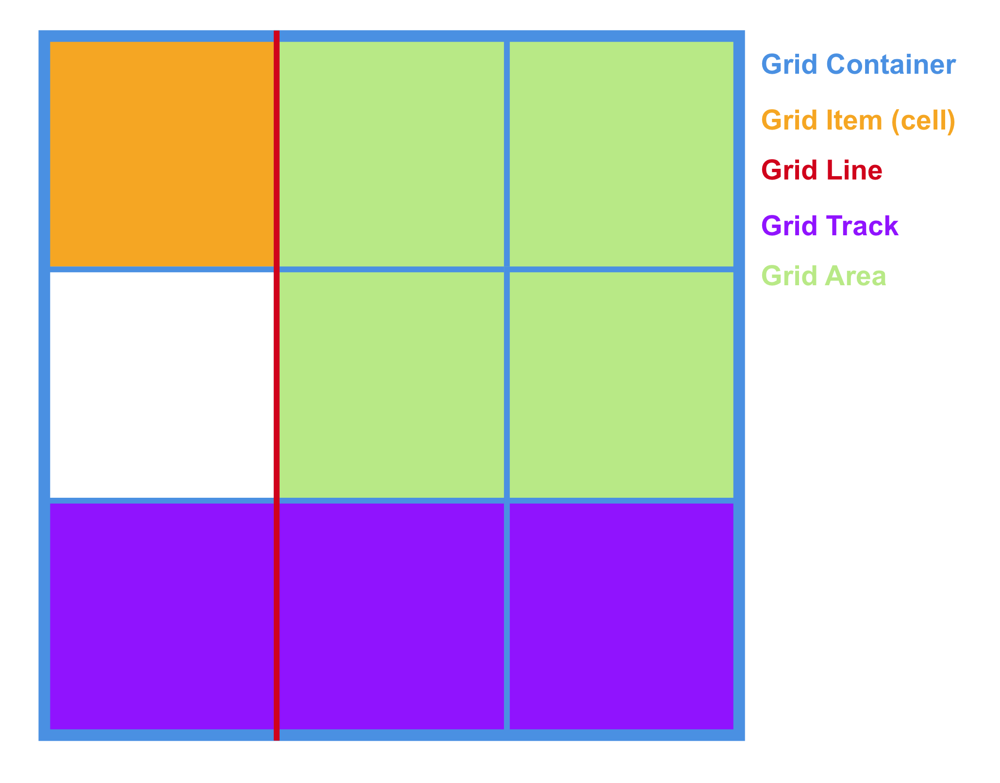

# CSS Grid

What does the future of CSS layout look like? While Flexbox is the current "next big thing", there's a even more advanced layout tool on the horizon - CSS Grid. It's a return to table-based layouts, but with more tools for customization and responsive design. It does grid layouts better than bootstrap, all with native CSS. While **CSS Grid is not supported enough to be used in production yet**, this is the time to learn it.

## Why Bother?

Because [this](http://labs.jensimmons.com/2016/). For the first time, **respoinsive, magazine-style layouts are a reality**. Go ahead - squish your browser screen!


## Getting Started

CSS Grid is so experimental, we'll have to enable a Chrome Flag to allow it in our browser. Open Chrome, and navigate to `chrome://flags`. Then enable "experimental web platform features".

## Basic Terminology

Much like Flexbox, CSS Grid introduces a host or new terminology for us to memorize. Here's a basic rundown:



- **Grid Container**: The element on which `display: grid` is applied. It acts as our container. 
- **Grid Item**: The children (e.g. direct descendants) of the grid container.
- **Grid Line**: The dividing lines that make up the structure of the grid. They can be either vertical ("column grid lines") or horizontal ("row grid lines").
- **Grid Track**: The space between two adjacent grid lines. You can think of them like the columns or rows of the grid. 
- **Grid Cell**: A single grid cell.
- **Grid Area**: Any collection of grid cells that is surrounded by four grid lines. 

## Demo - Nick's Legitimate Web Shop

Let's get our feet wet with CSS Grid by building a very simple Grid'd site. Run `npm install` and `gulp` on the root directory of this repo start compiling the Sass for our Very Legitimate Web Shop. By viewing `index.html` in your browser, you'll see a list of products with no real style applied to them. The products themselves are in a nice HTML structure, but so far, none of our CSS is taking advantage of it.

### Building the Grid Structure

There's two opportunities for grids in our file - a grid for the base layout of our page, and a sub-grid of our reasonably-priced products. Let's start with our base layout, by adding some styles to our `.grid` div.

```css
.grid {
    display: grid;
    grid-template-columns:  [left] 16vw 
                            [middle] auto 
                            [right] 16vw;

    grid-template-rows:     [row-1] 14vh
                            [row-2] auto
                            [row-3] 4vh;
    grid-template-areas:    "header header header"
                            "main main main"
                            "footer footer footer";
    grid-gap: 1em 1em;
    .item {
        color: $color-white;
    }
}
```

Let's break these down:

1. `display: grid;` - This tells our parent element that we'll be using CSS grid on all it's child elements.
2. `grid-template-columns` - This is where our actual grid begins. We start by declaring the number of columns, their name, and the space we want them to take up. In the above code, we've told our grid to be 3 columns across (left, middle, and right). The outer two columns will take up 16% of the viewport width (`16vw`), while the middle column will take up whatever space is leftover (`auto`)
3. `grid-template-rows` - Here we define the number, size, and names of our rows. We want to the header and footer to take up 14% and 4% of the viewport height, respectively (`14vh` and `4vh`).
4. `grid-template-areas` - Here we can name each section of our grid. By doing so, we can later [assign content to different grid areas](https://codepen.io/nickandersonr/pen/OmqYEy).
5. `grid-gap` - the space (similar to border) between grid cells. The first value sets the size for the space between rows, while the second value sets the size of the space between columns.

Next, let's add some structure to our `.products` sub-grid:

```CSS
    .products {
        display: grid;
        grid-template-columns:  [left] 1fr
                                [middle] 1fr 
                                [right] 1fr;

        grid-template-rows:     [row-1] 1fr
                                [row-2] 1fr
                                [row-3] 1fr;
        align-items: center;
        grid-gap: 1em 1em;
        div {
            background: $color-white;
            color: $color-darkblue;
            img {
                max-width: 100%;
            }
        }
    }
```

There's a few new calls to point out here:

1. `grid-template-columns` and `grid-template-rows` - We've set up a much simpler grid this time - a simple 3x3. Notice the new unit, `fr` - this means "fractional unit". In the case of our columns, it takes the available space and divides it into 3 equal parts, distrubiting the content evenly. A value of `2fr` would take up twice the amount of space as `1fr`.
3. `align-items` -  this declaration removes the full-width properties that would normally be applied to your block-level element, and aligns just the content to whatever axis you chose. In this case, we've chosen `center` so that our products are only as wide as their contents, and sit neatly centered in their respective column.

Save and refresh - BAM! That's a nice grid!

However, it's a little too rigid on smaller screens. Let's right some Media Queries to adjust our grid as we scale.

> Note - The following media queries are written to be desktop-first, not mobile-first. It's ok because we're experimenting! Normally, this would be a bad idea.

### Max-Width: 1024px (iPad Landscape)

```css
@media (max-width: 1024px) {
    .grid {     
        grid-template-columns:  [left] 10% 
                                [middle] auto 
                                [right] 10%;

        grid-template-rows:     [row-1] 1fr
                                [row-2] 5fr
                                [row-3] 1fr;
    }
    h1 {
        margin:70px 0;
    }
}
```

So - what did we change here, and why?
1. `grid-template-columns` - On smaller screens, we need less space on the left and right of our main column - so we've reduced it.
2. `grid-template-rows` - We've increased the height of `row-2` to `5fr`, so that it takes up 5/7ths of the space available to the content. Why such a weird fraction? Who cares! Bootstrap could never handle an uneven fraction, so we're simply taking advantage of our new tools.
3. `h1` - this is just adjusting our margin to better position our header text.

### Max-Width: 768px (iPad Portrait)

```css
    @media (max-width: 768px) {
        .grid {     
            grid-template-columns:  [left] 0% 
                                    [middle] auto 
                                    [right] 0%;

            grid-template-rows:     [row-1] 140px
                                    [row-2] auto
                                    [row-3] 40px;
        }
        .products {
            grid-template-columns:  [left] 1fr
                                    [right] 1fr;

            grid-template-rows:     [row-1] 1fr
                                    [row-2] 1fr
                                    [row-3] 1fr
                                    [row-4] 1fr;
        }
        h1 {
            font-size: 3em;
            margin:20px 0;
            padding: 0 10px;
        }
    }
```


## Examples

- [Chris House's Complete Guide to CSS Grid](http://chris.house/blog/a-complete-guide-css-grid-layout/)
- [Zurb's CSS Grid Examples](http://zurb.com/playground/css-grid-examples)
- [Jen Simmon's Guide to learning CSS Grid](http://jensimmons.com/post/feb-27-2017/learn-css-grid)
- [Jen Simmon's Labs](http://labs.jensimmons.com/)

## Sources

A large amount of this lesson came from Chris House's [A Complete Guide to CSS Grid Layout](http://chris.house/blog/a-complete-guide-css-grid-layout/  
). Experiments taked from [Jen Simmon's CSS Grid Labs](http://labs.jensimmons.com/).